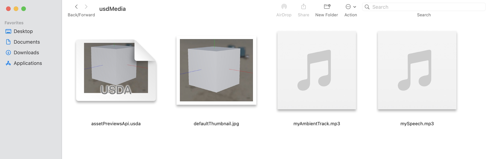

# Overview

The `UsdMedia` provides ways to associate various forms of media, such as 
audio (`SpatialAudio`) or thumbnails (`AssetPreviewsAPI`) with assets.

(usdMedia_working_with_media)=
## Working With Media

`SpatialAudio` allows for ambient audio playback or audio playback from a 
specific location. It also allows setting various playback options.

`AssetsPreviewsAPI` allows for setting one or more thumbnails for an asset. 
The thumbnails could be pre-rendered images of the asset that could be 
presented in the asset browser of a DCC tool, or in a system asset browser.

View the example below that utilizes both of these APIs, with an example from 
macOS Finder.



```{admonition} Thumbnail Usage
:class: note

Notice how Finder is using `defaultThumbnail.jpg` in the file icon for 
`assetPreviewsApi.usda`.
```


Below is one way to express `assetPreviewsApi.usda` from the image above.

```{code-block} usda
#usda 1.0
(
    defaultPrim = "World"
    endTimeCode = 2400
    startTimeCode = 0
    timeCodesPerSecond = 24
)

def Xform "World"(
    prepend apiSchemas = ["AssetPreviewsAPI"]
    assetInfo = {
        dictionary previews = {
            dictionary thumbnails = {
                dictionary default = {
                    asset defaultImage = @defaultThumbnail.jpg@
                }
            }
        }
    }
)
{
    def Cube "Cube"
    {
        def SpatialAudio "Speech"
        {
            uniform token auralMode = "spatial"
            uniform timecode endTime = 480
            uniform asset filePath = @mySpeech.mp3@
            uniform token playbackMode = "onceFromStartToEnd"
            uniform timecode startTime = 240
        }
    }

    def SpatialAudio "Ambient"
    {
        uniform token auralMode = "nonSpatial"
        uniform asset filePath = @myAmbientTrack.mp3@
        uniform token playbackMode = "loopFromStage"
    }
}

```

The following can be observed from the example above:
- The difference between using spatially played audio in `Speech` and 
nonSpatial audio in `Ambient`
- The way thumbnails are associated with assets, and how they can be utilized.
