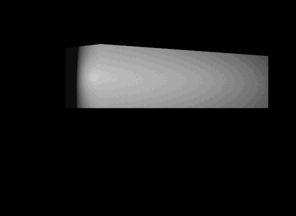
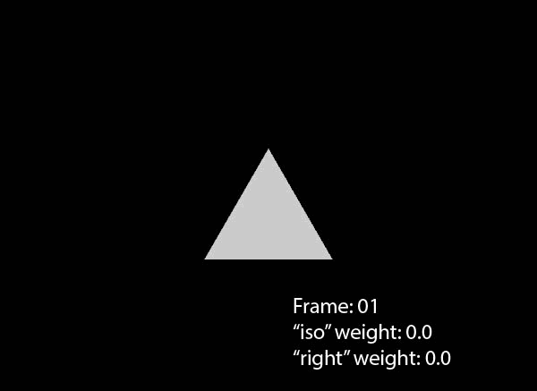

# Overview

The `UsdSkel` schema domain contains schemas to encode simple skeletons and 
blend shapes. `UsdSkel` is not intended to provide general rigging and 
execution behaviors.


(usdSkel_working_with_joint_animations)=
## Working with Joint Based Animations

Below is an example joint based animation.

```{code-block} usda

#usda 1.0
(
    defaultPrim = "World"
    endTimeCode = 10
    metersPerUnit = 0.1
    startTimeCode = 1
    upAxis = "Y"
)

def Xform "World"
{
    def SkelRoot "SkelRoot" (
        prepend apiSchemas = ["SkelBindingAPI"]
    )
    {
        prepend rel skel:animationSource = </World/SkelRoot/Animation>

        def Skeleton "Skeleton"
        {
            uniform matrix4d[] bindTransforms = [( (1, 0, 0, 0), (0, 1, 0, 0), (0, 0, 1, 0), (0, 0, 0, 1) ), ( (1, 0, 0, 0), (0, 1, 0, 0), (0, 0, 1, 0), (0, 0, 2, 1) ), ( (1, 0, 0, 0), (0, 1, 0, 0), (0, 0, 1, 0), (0, 0, 4, 1) )]
            uniform token[] joints = ["Shoulder", "Shoulder/Elbow", "Shoulder/Elbow/Hand"]
            uniform matrix4d[] restTransforms = [( (1, 0, 0, 0), (0, 1, 0, 0), (0, 0, 1, 0), (0, 0, 0, 1) ), ( (1, 0, 0, 0), (0, 1, 0, 0), (0, 0, 1, 0), (0, 0, 2, 1) ), ( (1, 0, 0, 0), (0, 1, 0, 0), (0, 0, 1, 0), (0, 0, 2, 1) )]
        }

        def SkelAnimation "Animation"
        {
            uniform token[] joints = ["Shoulder/Elbow"]
            quatf[] rotations.timeSamples = {
                1: [(1, 0, 0, 0)],
                10: [(0.7071, 0.7071, 0, 0)],
            }
            half3[] scales = [(1, 1, 1)]
            float3[] translations = [(0, 0, 2)]
        }

        def Mesh "Mesh" (
            prepend apiSchemas = ["SkelBindingAPI"]
        )
        {
            int[] faceVertexCounts = [4, 4, 4, 4, 4, 4, 4, 4, 4, 4]
            int[] faceVertexIndices = [2, 3, 1, 0, 6, 7, 5, 4, 8, 9, 7, 6, 3, 2, 9, 8, 10, 11, 4, 5, 0, 1, 11, 10, 7, 9, 10, 5, 9, 2, 0, 10, 3, 8, 11, 1, 8, 6, 4, 11]
            point3f[] points = [(0.5, -0.5, 4), (-0.5, -0.5, 4), (0.5, 0.5, 4), (-0.5, 0.5, 4), (-0.5, -0.5, 0), (0.5, -0.5, 0), (-0.5, 0.5, 0), (0.5, 0.5, 0), (-0.5, 0.5, 2), (0.5, 0.5, 2), (0.5, -0.5, 2), (-0.5, -0.5, 2)]
            matrix4d primvars:skel:geomBindTransform = ( (1, 0, 0, 0), (0, 1, 0, 0), (0, 0, 1, 0), (0, 0, 0, 1) )
            int[] primvars:skel:jointIndices = [2, 2, 2, 2, 0, 0, 0, 0, 1, 1, 1, 1] (
                elementSize = 1
                interpolation = "vertex"
            )
            float[] primvars:skel:jointWeights = [1, 1, 1, 1, 1, 1, 1, 1, 1, 1, 1, 1] (
                elementSize = 1
                interpolation = "vertex"
            )
            prepend rel skel:skeleton = </World/SkelRoot/Skeleton>
        }
    }
}
```

Here is the output of this animation:

Note: The camera has been moved and the animation slowed down for clarity.



Notice the following from the animation and how the file is structured:
- `Mesh` applies the `SkelBindingAPI` and is parented by a `SkelRoot`. These 
properties define that the mesh is in a `UsdSkel` hierarchy.
- `Mesh` defines a relationship with `skel:skeleton`, the prim `Skeleton`.
- `Skeleton` defines a `joints` array, a list of named joints. Parent 
relationships are defined with '/'. `Shoulder` is a parent of `Elbow`, `Elbow` 
is a parent of `Hand`.
- `Mesh` defines `skel:jointIndices` which are indices into the `joints` list 
on `Skeleton` and match up by index into `points`. For example, 
`skel:jointIndices` above means that the first 4 points in `points` belong to 
`Shoulder/Elbow/Hand`, the next 4 points belong to `Shoulder`, and the last 4 
belong to `Shoulder/Elbow`.
- `Mesh` defines `skel:jointWeights` which allows for points to be affected by 
transformations more or less than others. In our example all joint weights 
are 1, meaning whatever transformation is applied to them is multiplied by 1.
- `SkelRoot` defines a relationship to a `SkelAnimation` called `Animation`.
- `Animation` defines a `joints` array. The values in this `joints` array must 
match the values in the `joints` array in `Skeleton`, however only the joints 
that will be animated are required to be listed.
- `Animation` defines a rotation over time. Since the animation is only over 
`Shoulder/Elbow`, only those 4 points are rotated in the example.

(usdSkel_working_with_blendshape_animations)=
## Working with Blend Shape Based Animations

Below is an example blend shape animation.

```{code-block} usda

#usda 1.0
(
    defaultPrim = "World"
    endTimeCode = 10
    metersPerUnit = 0.01
    startTimeCode = 1
    upAxis = "Y"
)

def Xform "World"
{
    def SkelRoot "MorphingTri" (
        prepend apiSchemas = ["SkelBindingAPI"]
    )
    {
        rel skel:skeleton = </World/MorphingTri/Skel>
        def Skeleton "Skel" {}

        rel skel:animationSource = </World/MorphingTri/Anim>
        def SkelAnimation "Anim"
        {
            uniform token[] blendShapes = ["iso", "right"]
            float[] blendShapeWeights.timeSamples = {
                1: [0, 0],
                5: [1, 0],
                9: [0, 0],
                13: [0, 1],
                17: [1, 1],
            }
        }

        def Mesh "Mesh" (
            prepend apiSchemas = ["SkelBindingAPI"]
        )
        {
            point3f[] points = [(0.5, 0, 0), (0, 0.8660254, 0), (-0.5, 0, 0)]

            uniform token[] skel:blendShapes = ["iso", "right"]
            rel skel:blendShapeTargets = [
                </World/MorphingTri/Mesh/iso>,
                </World/MorphingTri/Mesh/right>,
            ]
            def BlendShape "iso"
            {
                uniform vector3f[] offsets = [(0, 0.8660254, 0)]
                uniform int[] pointIndices = [1]
            }
            def BlendShape "right"
            {
                uniform vector3f[] offsets = [(-0.5, 0.1339746, 0)]
                uniform int[] pointIndices = [1]
            }


            float3[] extent = [(-0.5, 0, 0), (0.5, 0.8660254, 0)]
            int[] faceVertexCounts = [3]
            int[] faceVertexIndices = [0, 1, 2]
        }
    }
}
```

Here is the output of this animation, labeled for clarity:



Notice the following from the animation and how the file is structured:
- `Mesh` applies the `SkelBindingAPI` and is parented by a `SkelRoot`. These 
properties define that the mesh is in a `UsdSkel` hierarchy.
- `Mesh` parents two defined `BlendShape` prims, `iso` and `right`. These 
prims define their desired shapes in terms of `offsets`. These offsets 
directly relate to the parented mesh `points` array and lengths matter. The 
length of the offsets array must match the length of the `pointIndices` array. 
The values in the `pointIndices` array must be a valid index into the points 
array.
- `MorphingTri` applies the `SkelBindingAPI` and binds both a 
`skel:animationSource` and `skel:skeleton`. `MorphingTri` parents all of the 
prims that are defined in UsdSkel.
- `Anim` defines `blendShapes` this list is the same as `skel:blendShapes` in 
`Mesh`.
- `Anim` defines `blendShapeWeights` as time samples. This list contains 
indices into the `blendShapes` array, defining the weight of that blend shape 
at that time sample.
