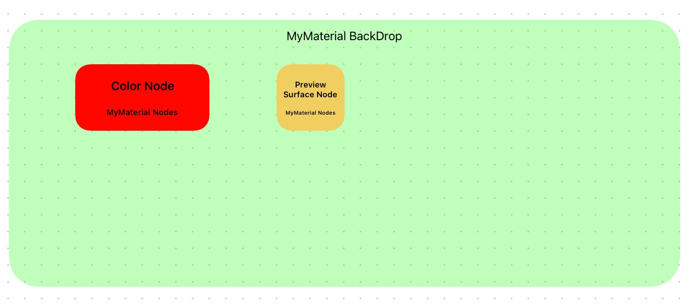

# Overview

The UsdUI schema domain contains schemas for working with node graphs. UsdUI
allows the user to describe where the nodes are with `NodeGraphNodeAPI`, add 
descriptive labels and groups to nodes with `SceneGraphPrimAPI`, and to 
visually organize nodes with Backdrops.

A node graph simplifies the creation complicated networks, such as shading 
networks. UsdUI provides the ability to label prims to support these networks.

(usdUI_working_with_node_graphs)=
## Working With Node Graphs

The `SceneGraphPrimAPI` allows each node to contain a descriptive name 
(`ui:displayName`), a descriptive group (`ui:displayGroup`).

The `NodeGraphNodeAPI` defines how each node appears in the node graph. 
This includes its position (`ui:nodegraph:node:pos`), color
(`ui:nodegraph:node:displayColor`), a link to documentation about the node 
(`ui:nodegraph:node:docURI`), the amount of information the node currently
displays (`ui:nodegraph:node:expansionState`), an icon image to express the
node's intent (`ui:nodegraph:node:icon`), its size (`ui:nodegraph:node:size`),
and its relative depth to other nodes in the graph (`ui:nodegraph:node:stackingOrder`).

Using Backdrops allows nodes to be grouped by region, by underlaying the 
containing nodes and adding a description (`ui:description`). Backdrops would
typically have positions and sizes from the `NodeGraphNodeAPI`.

View the image below to see how these details can be presented to the user.



Below is one way to express the above file in usda

```{code-block} usda
def Scope "Materials"
{
    def Material "MyMaterial"
    {
        token outputs:mtlx:surface.connect = </Materials/MyMaterial/PreviewSurface.outputs:out>

        def Shader "PreviewSurface" (
            prepend apiSchemas = ["NodeGraphNodeAPI"]
        )
        {
            uniform token info:id = "ND_UsdPreviewSurface_surfaceshader"
            color3f inputs:diffuseColor.connect = </Materials/MyMaterial/Color.outputs:out>
            token outputs:out
            
            uniform color3f ui:nodegraph:node:displayColor = (1, 1, 0)
            uniform string ui:nodegraph:node:docURI = "https://openusd.org/release/spec_usdpreviewsurface.html"
            uniform token ui:nodegraph:node:expansionState = "open"
            uniform asset ui:nodegraph:node:icon = @preview_surface_icon.png@
            uniform float2 ui:nodegraph:node:pos = (-200, 100)
            uniform float2 ui:nodegraph:node:size = (100, 100)
            uniform int ui:nodegraph:node:stackingOrder = 1
            uniform token ui:displayGroup = "MyMaterial Nodes"
            uniform token ui:displayName = "Preview Surface Node"
        }

        def Shader "Color" (
            prepend apiSchemas = ["NodeGraphNodeAPI"]
        )
        {
            uniform token info:id = "ND_constant_color3"
            color3f inputs:value = (1, 0.023, 0.701)
            color3f outputs:out
            
            uniform color3f ui:nodegraph:node:displayColor = (0, 0, 1)
            uniform string ui:nodegraph:node:docURI = "https://github.com/AcademySoftwareFoundation/MaterialX/blob/main/documents/Specification/MaterialX.Specification.md#procedural-nodes"
            uniform token ui:nodegraph:node:expansionState = "closed"
            uniform asset ui:nodegraph:node:icon = @color_icon.png@
            uniform float2 ui:nodegraph:node:pos = (-500, 100)
            uniform float2 ui:nodegraph:node:size = (200, 100)
            uniform int ui:nodegraph:node:stackingOrder = 2
            uniform token ui:displayGroup = "MyMaterial Nodes"
            uniform token ui:displayName = "Color Node"
        }

        def Backdrop "Backdrop" (
            prepend apiSchemas = ["NodeGraphNodeAPI"]
        )
        {
            uniform token ui:description = "MyMaterial Backdrop"
            uniform color3f ui:nodegraph:node:displayColor = (0, 1, 0)
            uniform float2 ui:nodegraph:node:pos = (-600, 50)
            uniform float2 ui:nodegraph:node:size = (1000, 400)
        }
    }
}

```
